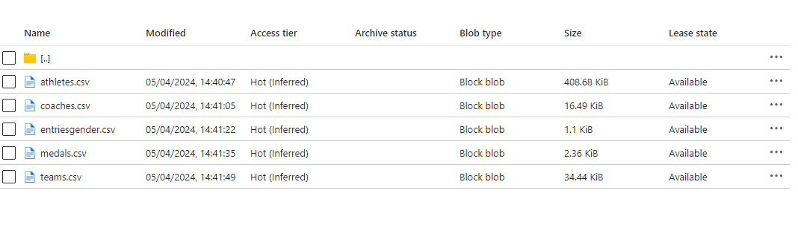
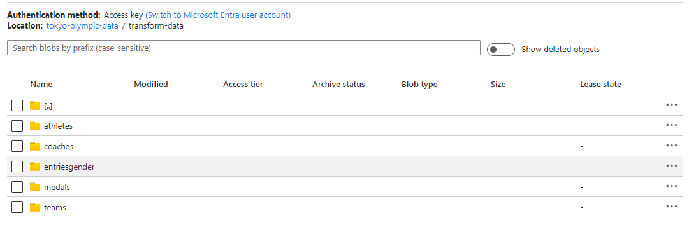
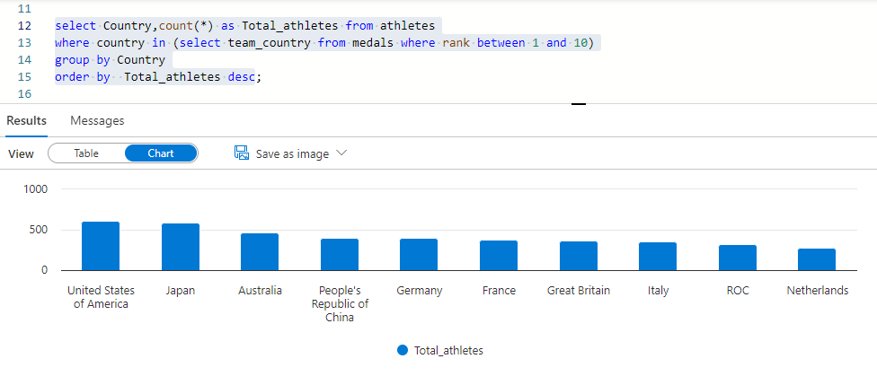
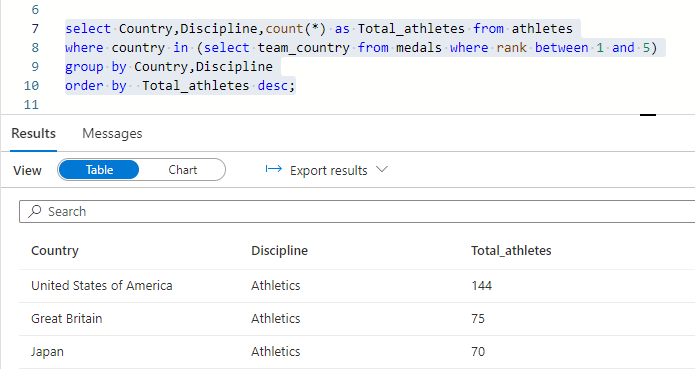
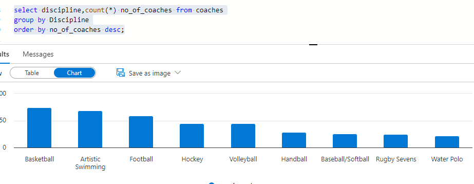
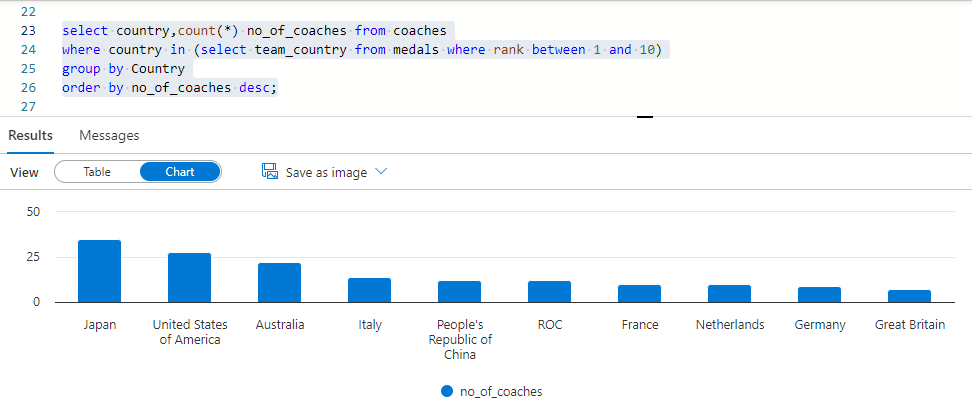
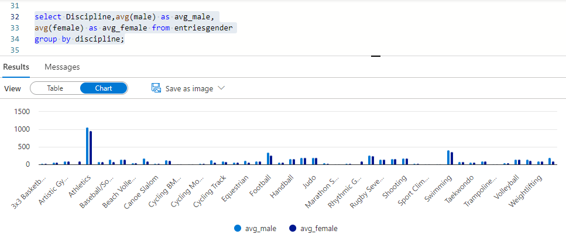
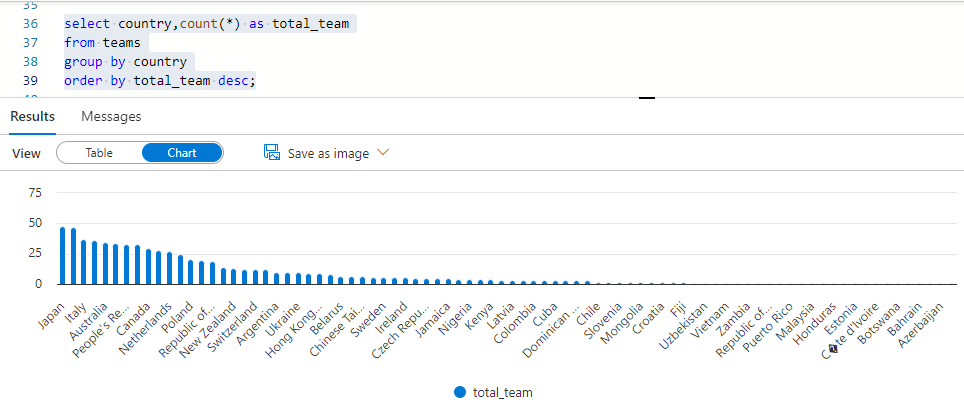

# tokyo-olympic-data
This project deals with Tokyo Olympics 2021 dataset. This project involves understanding the data architecture, creating the ETL pipeline, and finally analysing the data. The project is based off Darshil Parmar video on YouTube. This contains the details of over 11,000 athletes, with 47 disciplines, along with 743 Teams taking part in the 2021(2020) Tokyo Olympics. This dataset contains the details of the Athletes, Coaches, Teams participating as well as the Entries by gender. It contains their names, countries represented, discipline, gender of competitors, name of the coaches.

There are 5 datasets from which the data was extracted to perform analysis.

Athletes data: The file contains all athletes data. Columns: Name, Name of Country (NOC) and Discipline
Coaches data: The file contains coaches names. Columns: Name, Name of Country (NOC), Discipline and Event
Entries Gender data: The file contains males and females data. Columns: Discipline, Female, Male and Total
Medals data: The file contains ranks and all the three medals. Columns: Rank, Team/NOC, Gold, Silver, Bronze, Total, Rank by Total
Teams Data: The file contains all the teams. Columns: Name, Name of Country (NOC), Discipline and Event
Source of the dataset: Link

Data Architecture

Data Ingestion
Extract the data from the the github as a source using Azure Data Factory tool, building a data flow and loading it into Azure Data Lake storage:

Data Transformation in Azure Databricks:
Write the code in Python to read the data stored in the Azure data lake, perform the transformations and then load the back to Azure data lake Gen 2

Here you upload your transformed data in ADLS Gen 2:

Data Analysis
The final step is to analyse and derive important insights from this data using SQL.

Calculating the total number of athletes from ran 1 to 10 country

Total no of athletes by discipline for top 5 country

Total no.of coaches by discipline

No of coaches in the country who won the highest medals

-- calculate the average number of entries by gender for each discipline

Total no.of teams by each country

